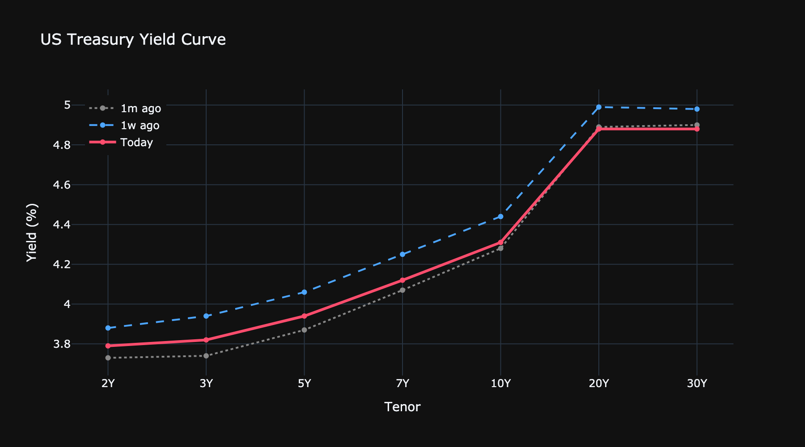

# Morning Rates Scan — 19 Apr 2026

_2s10s flattened 4.0 bps this week to **+52 bps**._

[See the live curve →](https://your-dashboard-url.com/Yield_Curve?utm_source=substack&utm_medium=brief&utm_campaign=morning_scan&utm_content=2026-04-19)

## Top 5 trades by Sharpe

| Trade | Sharpe | Z | E[Ret] (bps) | Risk | D1W |
|---|---:|---:|---:|---:|---:|
| Rcv 2Y/5Y/30Y | +0.74 | -0.66 | +18 | 24 | +0.0 |
| Rcv 3Y/5Y/30Y | +0.69 | +0.69 | +13 | 20 | -1.2 |
| Rcv 3Y/5Y/20Y | +0.66 | +0.32 | +12 | 18 | -0.6 |
| Rcv 2Y/5Y/20Y | +0.64 | -0.75 | +16 | 25 | +0.5 |
| Rcv 7Y/10Y/30Y | +0.53 | -0.57 | +7 | 13 | -2.6 |

[Full scanner on the dashboard →](https://your-dashboard-url.com/Analysis?utm_source=substack&utm_medium=brief&utm_campaign=morning_scan&utm_content=2026-04-19)

## Z-score extremes (1Y lookback)

**Cheap (Z < -2):**

- Rcv 5Y/10Y/20Y — Z=-2.45, Sharpe=+0.16
- Rcv 5Y/10Y/30Y — Z=-2.36, Sharpe=+0.27
- Rcv 5Y/10Y — Z=-2.21, Sharpe=-0.02
- Rcv 5Y/7Y — Z=-2.20, Sharpe=-0.03
- Rcv 3Y/10Y/30Y — Z=-2.19, Sharpe=+0.28

## Biggest weekly movers

- Rcv 2Y/30Y — D1W=+63.9 bps, Z=-1.67
- Rcv 3Y/30Y — D1W=+56.9 bps, Z=-1.98
- Rcv 2Y/20Y — D1W=+48.8 bps, Z=-1.66
- Rcv 3Y/20Y — D1W=+43.2 bps, Z=-1.98
- Rcv 5Y/30Y — D1W=+31.8 bps, Z=-2.00

---
_Data via the [Macro Manv rates dashboard](https://your-dashboard-url.com?utm_source=substack&utm_medium=brief&utm_campaign=morning_scan&utm_content=2026-04-19) — updated daily._